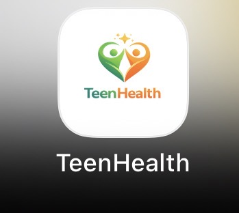
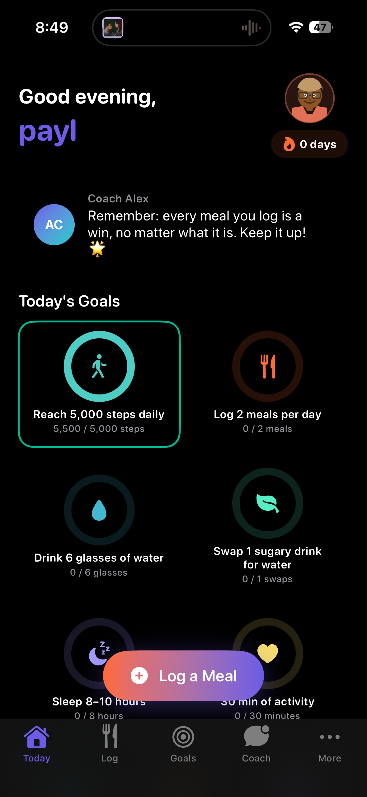
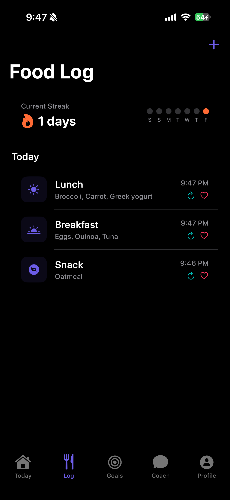
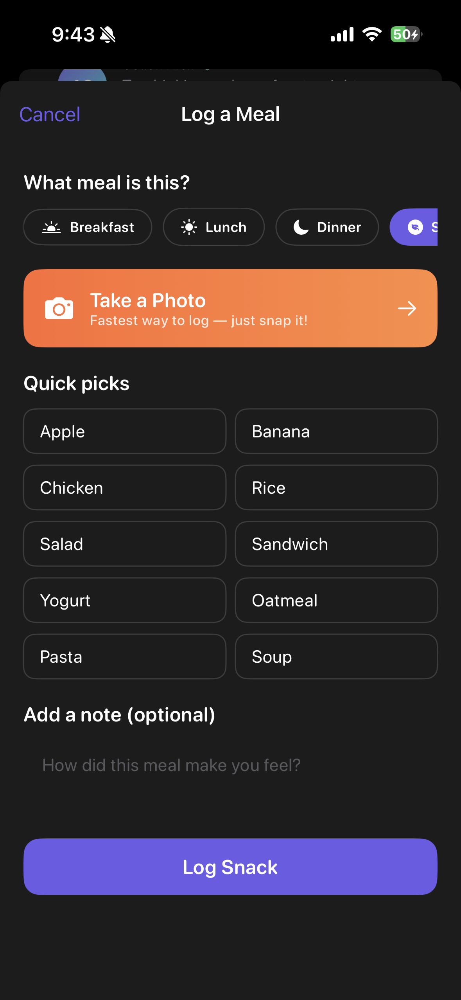
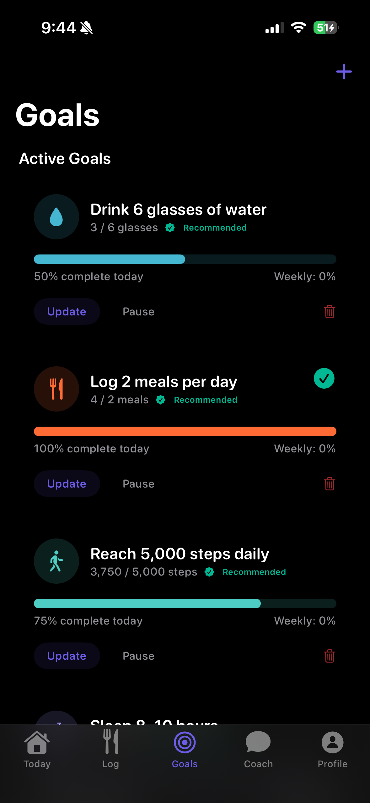
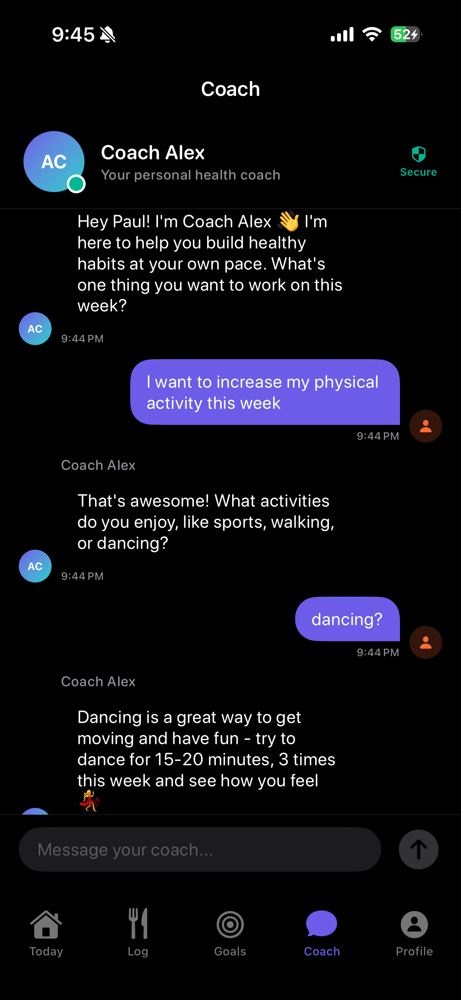
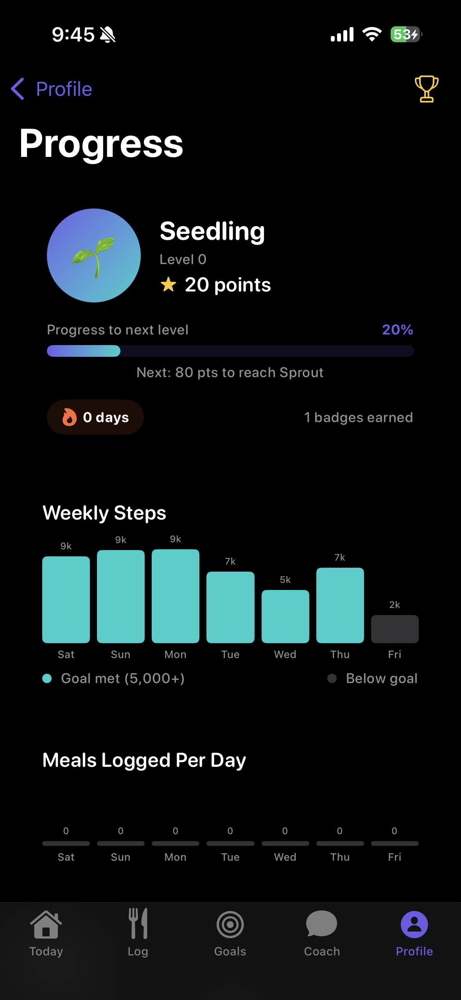

# TeenHealth

> A research-backed iOS app helping teenagers (ages 13–17) build healthier habits — one small win at a time.

**Developer:** [pauldongin.github.io](https://pauldongin.github.io)

TeenHealth is designed as a **supplement to clinical care**, not a replacement. It focuses on the lifestyle factors most supported by adolescent health research: meal logging, daily movement, hydration, and sleep — without calorie counting, dieting, or weight-loss framing.

---

## App Icon

<p align="center">
  
</p>

---

## Why This App?

Most health apps for teenagers either treat them like adults (calorie deficits, BMI tracking) or feel too childish to take seriously. TeenHealth is built around four evidence-based principles:

- **Self-monitoring works** — consistent meal and activity logging is one of the strongest predictors of healthy habit formation in adolescents
- **Autonomy matters** — goals are chosen by the teen, not imposed by the app or a parent
- **Small wins drive engagement** — a gamification system (points, levels, badges, streaks) keeps teens coming back without pressure
- **Coach relationships help** — a supportive, non-judgmental AI coach provides real-time encouragement and guidance

---

## Features

### Today Dashboard



The home screen gives teens a full picture of their day at a glance.

- Personalized greeting with the user's emoji avatar
- **Progress rings** for each active goal — turn green with a checkmark on completion
- Live stats from HealthKit: steps, active energy (kcal), sleep hours
- A daily tip from **Coach Alex**
- Today's meal log timeline
- One-tap **"Log a Meal"** floating button

<br clear="right"/>

---

### Food Log



A full history of everything logged, organized by day.

- **Streak tracker** with a weekly dot indicator (lights up on days you logged)
- Meals listed by type: breakfast, lunch, dinner, snack
- Quick **re-log** button to repeat a previous meal in one tap
- **Favourite** button to save meals for the quick-pick grid

<br clear="right"/>

---

### Log a Meal



Logging is designed to take under 10 seconds.

- **Meal type selector**: Breakfast / Lunch / Dinner / Snack
- **Take a Photo** — fastest method, just snap it
- **Quick-pick grid**: Apple, Banana, Chicken, Rice, Salad, Sandwich, Yogurt, Oatmeal, Pasta, Soup, and more
- Optional note: *"How did this meal make you feel?"*

<br clear="right"/>

---

### Goals



Teens set and own their own goals — nothing is imposed.

- 3 research-backed **starter goals** auto-created on signup (2 meals/day, 5,000 steps, 6 glasses of water)
- Live **progress bars** with percentage complete
- Completed goals show a **green checkmark**
- Update, pause, or delete any goal
- Add fully **custom goals** with the + button

<br clear="right"/>

---

### AI Coach



Real conversations with **Coach Alex**, powered by Groq (Llama 3.3 70B).

- Context-aware replies using the last 10 messages
- Encouraging, non-restrictive tone — never mentions calories, weight, or dieting
- Typing indicator, message timestamps, read receipts
- Secure indicator on every session
- Falls back gracefully if the network is unavailable

<br clear="right"/>

---

### Progress



A gamified view of how far the teen has come.

- **Level system**: Seedling → Sprout → ... with point milestones
- Weekly bar charts for **steps** and **meals logged**
- HealthKit-integrated step data with goal-met vs. below-goal coloring
- **Badge collection** and current streak display

<br clear="right"/>

---

### Onboarding
- COPPA-compliant parental consent + teen assent flow before any data is collected
- Custom **emoji avatar** with personalized background color (4 categories: Faces, Active, Animals, Chill)
- Swipe-lock: required fields must be completed before advancing

### Support
- **Crisis Text Line** direct link (Text HOME to 741741)
- "Talk to Your Coach" shortcut
- "Tell a Trusted Adult" guidance
- Built into the app so help is always one tap away

### Settings
- Profile and avatar editing
- Notification preferences (meal, step, and weigh-in reminders)
- HealthKit permissions management
- Full data deletion

---

## Tech Stack

| Layer | Technology |
|---|---|
| Language | Swift 5.9 |
| UI | SwiftUI (iOS 17+) |
| Architecture | MVVM |
| Persistence | SwiftData (on-device only, no iCloud) |
| Health data | HealthKit (steps, active energy, sleep, weight) |
| AI Coach | Groq API — Llama 3.3 70B |
| Notifications | UserNotifications |
| Project generation | XcodeGen |

---

## Requirements

- iOS 17.0+
- Xcode 15+
- A physical iPhone or iOS Simulator

---

## Getting Started

1. **Clone the repo**
   ```bash
   git clone https://github.com/pauldongin/TeenHealth.git
   cd TeenHealth
   ```

2. **Install XcodeGen** (if not already installed)
   ```bash
   brew install xcodegen
   ```

3. **Generate the Xcode project**
   ```bash
   xcodegen generate
   ```

4. **Add your Groq API key**

   Create `TeenHealth/Secrets.swift` (this file is gitignored):
   ```swift
   enum Secrets {
       static let groqAPIKey = "YOUR_GROQ_API_KEY"
   }
   ```
   Get a free key at [console.groq.com](https://console.groq.com)

5. **Open in Xcode**
   ```bash
   open TeenHealth.xcodeproj
   ```

6. **Set your Development Team** in Xcode → Target → Signing & Capabilities, then run with **Cmd+R**

---

## Privacy & Data

- All personal data is stored **on-device only** — nothing is sent to a third-party server
- Coach messages are processed by Groq's API only — no data is stored or sold
- Parental consent is required before any data is collected (COPPA-aware flow)
- Users can delete all their data at any time from Settings

---

## Availability

Currently available in **developer mode only** — the app must be built and installed via Xcode directly onto your device. Not yet on the App Store.

---

## Disclaimer

TeenHealth is a wellness tracking tool intended to **supplement** — not replace — care from a qualified healthcare provider. Always consult your medical team when making decisions about your health.

---

## License

© 2026 Paul Son. All Rights Reserved.

This project is publicly visible for portfolio purposes. You may not copy, distribute, modify, or use any part of this code without explicit written permission from the author.
